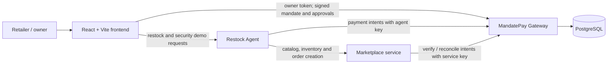

# MandateMarket · MandatePay

**A safer way for local retailers to restock together—with an explicit owner-controlled boundary between an AI agent and money.**

MandateMarket helps neighbourhood retailers discover products, compare marketplace prices and coordinate bulk buying. Its restock agent can propose and place marketplace orders, while **MandatePay** checks every payment request against a mandate signed by the retailer. The agent can request a payment; it cannot expand its own authority or bypass the gateway.

> Built for Wema Hackaholics 7.0. This is a demonstration system: authentication tokens, marketplace data and payment rails are for demo use. No real bank transfer or card payment is made.

**Live demo:** [mandatemarket.vercel.app](https://mandatemarket.vercel.app/)<br>
**Gateway API:** [gateway-u3w0.onrender.com](https://gateway-u3w0.onrender.com)<br>
**Agent API:** [agent-2v5n.onrender.com](https://agent-2v5n.onrender.com)

## The problem

Small retailers often buy inventory in small quantities, through several intermediaries, and with limited visibility into fair prices or nearby demand. That can mean higher unit costs, stockouts and cash tied up in inventory. Group buying can improve purchasing power, but delegating restocking to software introduces a different risk: an AI agent can misunderstand a request, be manipulated by an invoice, or send money to the wrong destination.

Giving an agent unrestricted payment credentials makes a mistake or attack potentially costly. A prompt, a confirmation in chat, or an agent’s own claim that a payment was approved is not a reliable authorization control.

## The solution

MandateMarket brings product discovery, demo marketplace orders and agent-assisted restocking into one retailer experience. MandatePay acts as a policy-enforcing gateway between the agent and the retailer’s funds:

1. The owner defines permitted suppliers, per-payment thresholds and rolling spend caps.
2. The owner signs the mandate in the browser. The Gateway verifies that signature and stores the active rules.
3. The agent creates marketplace orders and submits payment intents using its limited agent credential.
4. The Gateway makes the decision from the signed mandate and current state: allow within limits, ask the owner for approval, or block an unsafe request.
5. Decisions and state changes are recorded in an auditable, hash-linked event log.

The core principle is **bounded autonomy**: the agent can do routine work inside owner-approved limits, but the owner and Gateway retain control when a request needs approval or must be stopped.

## What the demo shows

- **Marketplace and group buying:** browse a seeded local catalog, view listed prices and explore community buying flows.
- **Owner Console:** connect with a demo owner token and inspect wallet, active mandate, approvals, payment intents, kill switch and audit events.
- **Signed mandate rules:** set allowed payees, automatic-payment and hard limits, and daily and weekly caps. Rule changes are signed in the browser and enforced by the Gateway.
- **Restock agent:** run a deterministic Suggested plan or use the optional Groq-backed LLM mode. The agent uses marketplace products and prices, creates orders and submits payment intents to the Gateway.
- **Owner approval:** payments above the automatic threshold can wait for an owner decision. Approval is signed and bound to the specific intent.
- **Security scenarios:** demonstrate poisoned payees, changed bank destinations, oversized payments, spending velocity, forged approval claims and kill-switch enforcement.
- **Audit and reset:** inspect gateway decisions and the hash-linked audit trail; reset demo state for a fresh walkthrough.

With the default demo mandate, the scripted restock plan is designed to return **two ALLOW decisions and one ASK**. The default example uses a ₦50,000 automatic limit, a ₦150,000 hard per-payment limit, a ₦200,000 daily cap and a ₦600,000 weekly cap. These are demo values, editable in the Owner Console.

## 2:30 demo video flow

Prepare before recording: open the deployed app, connect the Owner Console, ensure an active signed mandate exists, and clear old demo activity if needed. After a reset, sign and activate a mandate again before running the agent. Keep the Console and Security Demo tabs ready so navigation is quick.

| Time | Show | Suggested narration |
|---|---|---|
| **0:00–0:15** | Marketplace home or catalog | “Small retailers lose time and margin restocking alone. AI can help coordinate buying—but it should never have unrestricted access to the owner’s money.” |
| **0:15–0:45** | Owner Console, active signed mandate and limits | “The owner sets the boundary: approved suppliers, an automatic limit, a hard ceiling and daily and weekly caps. These rules are signed by the owner and enforced by MandatePay.” Point to the active mandate and key thresholds. |
| **0:45–1:10** | Suggested restock plan → approve → result | “The agent creates real demo marketplace orders at catalog prices. The Gateway evaluates each payment independently: two fit the automatic rules, while the larger order needs the owner.” Show the **2 allowed / 1 awaiting approval** result. |
| **1:10–1:35** | Owner Console → pending approval → approve → audit log | “The owner reviews the exact payment and approves it. That approval is signed for this intent; the agent cannot approve its own request. The decision appears in the audit trail.” |
| **1:35–2:05** | Security Demo; run one scenario such as swapped destination or oversized payment | “Now I change the destination / exceed the hard limit. Even if the agent requests it, the Gateway blocks it under the owner’s mandate.” Show the BLOCK reason. |
| **2:05–2:25** | Audit log and mandate/usage summary | “Every important decision is visible and linked in the audit history. This is bounded autonomy: let the agent handle routine restocking, while the owner sets the rules and the Gateway enforces them.” |
| **2:25–2:30** | End card / product name | “MandateMarket with MandatePay: group buying with guardrails for AI-driven payments.” |

**Recording tips:** use one attack scenario rather than running all six; keep the mandate and console visible long enough to read the thresholds; avoid showing API keys or entering secrets on camera. If you reset state between takes, create a new signed mandate before the next restock run.

## Architecture



The Gateway is the policy authority. The agent does not hold a bank credential, and the Gateway does not trust free-form agent text as authorization. In this demo, the gateway ledger/rail is simulated; the marketplace and service APIs are demo services.

## Repository layout

```text
.
├── contracts/              # Mandate schema, API contracts, signing vectors and shared seed
├── data/                    # Demo catalog and generated sales history
├── docs/                    # Project specification and supporting material
├── frontend/                # React 19 + TypeScript + Vite retailer and owner UI
├── services/
│   ├── gateway/              # FastAPI policy engine, mandates, approvals, audit and mock rail
│   ├── market/               # FastAPI catalog, inventory, pools and demo orders
│   └── agent/                # FastAPI restock agent, forecasts and security scenarios
├── scripts/                 # Contract checks, data generation and demo utilities
├── docker-compose.yml       # Local backend stack
└── render.yaml              # Render service configuration
```

## Run locally

### Requirements

- Docker and Docker Compose for the backend services and PostgreSQL.
- Node.js and npm for the frontend.
- Python 3.11+ only if running an individual service outside Docker.

### Start the backend

From the repository root:

```bash
docker compose up --build
```

The Gateway is available at `http://localhost:8001`, Marketplace at `http://localhost:8002`, and Agent at `http://localhost:8003`. The Gateway creates its schema and seeds the demo owner, agent and payees at startup when its database is empty.

### Start the frontend

In a second terminal:

```bash
cd frontend
npm install
npm run dev
```

The local frontend defaults to the local Gateway and Agent. `frontend/.env.example` documents the optional Vite URL overrides:

```dotenv
VITE_API_URL=http://localhost:8001
VITE_AGENT_URL=http://localhost:8003
```

After opening the app, go to **Profile → Owner Console**, connect with the seeded demo owner token `tok_owner_ada`, and choose **Sign & activate mandate** if there is no active mandate. The demo agent uses the seeded `key_agent_restock` credential to submit requests. Demo credentials are public fixtures, not production secrets.

To generate synthetic sales data or check API contract consistency:

```bash
python scripts/gen_sales.py
python scripts/check_contracts.py
```

## Configuration and deployment

The frontend is deployed on Vercel; the Gateway, Marketplace and Agent are configured as Render services in `render.yaml`. The frontend uses `VITE_API_URL` and `VITE_AGENT_URL` for service URLs; Vite variables are public and must never contain secrets.

The Suggested (scripted) restock mode is deterministic and needs no LLM key. The optional LLM mode uses Groq when `GROQ_API_KEY` is configured on the **Agent service**. Store the key as a secret environment variable on Render; do not put it in the frontend, commit it, or paste it into source control. If the LLM service is unavailable, the LLM run reports an error rather than silently changing the plan.

The demo owner token and agent key are seeded fixtures for this showcase. Use proper identity, key management, persistent production data, monitoring, and a real payment provider before any production use.

## Security scenarios

| Scenario | Threat | Expected control |
|---|---|---|
| S1 · Poisoned payee | Invoice points to an unregistered supplier | Block because the payee is outside the signed allowlist |
| S2 · Swapped destination | Supplier bank account is replaced | Block because the destination does not match the registered payee |
| S3 · Inflated amount | A large order exceeds the hard per-payment ceiling | Block at the hard limit |
| S4 · Velocity | Repeated payments exhaust the daily cap | Allow only within remaining cap; block once the cap would be exceeded |
| S5 · Forged approval | Agent text claims the owner already approved | Require a valid owner decision bound to the exact payment intent |
| S6 · Kill switch | Owner disables agent payments | Block new payment intents while the switch is active |

Run scenarios from **Profile → Security Demo**. For a clean run, reset the demo state and then reconnect the Owner Console and sign a fresh mandate. The attack suite may create several pending approvals as part of its scenarios; inspect the individual scenario results and audit events.

## API health checks

- Gateway: `GET /healthz`
- Marketplace: `GET /healthz`
- Agent: `GET /healthz`
- Agent forecast: `GET /agent/v1/forecast`
- Agent restock run: `POST /agent/v1/restock/runs` then poll `GET /agent/v1/restock/runs/{run_id}`
- Agent attack scenarios: `GET /agent/v1/attacks`
- Gateway API contract: [`contracts/gateway.openapi.yaml`](contracts/gateway.openapi.yaml)

## Project documentation

- [Project specification](docs/PROJECT_SPEC.md)
- [Gateway service notes](services/gateway/README.md)
- [Marketplace service notes](services/market/README.md)
- [Agent service notes](services/agent/README.md)

## License

No license is currently specified. Contact the project maintainers before reusing this code outside the demo.
