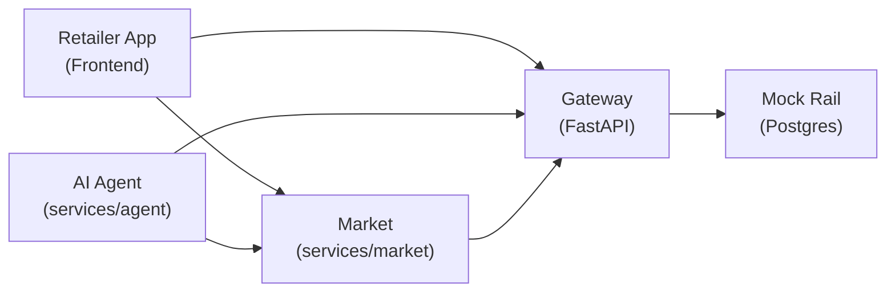

# TrustRail — MandatePay Project Specs Summary


## 1. What It Is

**MandatePay** is a payment-safety gateway for AI agents. It sits between an autonomous AI "restock agent" and a mock payment rail, enforcing **owner-signed spending rules** (mandates). The demo scenario: a small Nigerian retailer ("Ada") lets an AI agent auto-restock her shop from a wholesale marketplace — but with cryptographic guardrails that cap exposure even if the agent is compromised.

### Core Principle
> *"Assume the agent will be fooled. Worst case is the cap, not the balance."*

---

## 2. Architecture Overview



### Four Services
| Service | Path | Role |
|---------|------|------|
| **Gateway** | `services/gateway` | Policy engine, payment intent processing, audit log |
| **Market** | `services/market` | Wholesale marketplace — pools, orders, settlement |
| **Agent** | `services/agent` | AI restock agent (forecast + recommendations) |
| **Frontend** | `apps/web/` | Console (owner dashboard) + Retail app + UI kit |

---

## 3. The Agent's Role (ML Engineer — `services/agent`)

The agent is the **ML Engineer's** responsibility. It lives at `services/agent/` and has these key components:

### 3.1 Endpoints
| Endpoint | Method | Purpose |
|----------|--------|---------|
| `/agent/v1/forecast` | `GET` | Returns demand forecast per SKU (shape per spec 4.9) |
| `/agent/v1/recommendations` | `GET` | Returns restock recommendations |
| `/agent/v1/restock/runs` | `POST` | Execute a restock run (place orders via Market → pay via Gateway) |
| `/agent/v1/attacks` | `GET` | List attack scenarios for the demo |

### 3.2 Two Modes
- **`scripted`** (default for demo): Deterministic planner, no LLM needed
- **`llm`**: Uses `LLM_API_KEY` for real LLM-powered decisions; falls back to scripted on error

### 3.3 What the Agent Does
1. **Forecast**: Seasonal-naive baseline vs Holt-Winters on `data/sales_90d.csv` (6 SKUs)
2. **Reorder Point**: `lead_time_demand + safety_stock (z=1.65 × σ × √lead_time)`
3. **Recommend**: Which SKUs to restock, quantities, which pool/producer
4. **Execute**: Place orders on Market, then call `POST /v1/payment-intents` on Gateway
5. **Respect Decisions**: If Gateway says ALLOW → done; ASK → wait for owner; BLOCK → stop, report, **never retry with different payee**

### 3.4 Tools (for the planner)
The agent's tools and rules are defined in spec section 4.9:
- `get_forecast(sku_id)` → forecast data
- `get_catalog()` → available products from market
- `get_mandate_usage()` → remaining budget/headroom
- `place_order(sku_id, qty, pool_id)` → market order
- `request_payment(payee_id, amount, reference, description)` → gateway payment intent

### 3.5 Golden Path Constraint
> Catalog prices must make the restock run produce **2 ALLOW and 1 ASK** under the default mandate.

---

## 4. Security / Policy Engine (spec 4.4)

### Decision Flow (deterministic, pure function)
```
BLOCK if: kill switch active, no active mandate, mandate expired/not-yet-valid,
          currency mismatch, payee unknown, destination mismatch, payee not allowed,
          intent expired, per-txn hard max exceeded, window cap exceeded, insufficient funds

ASK if:   quarantined, over auto limit, anomalous amount

ALLOW:    everything else
```

### Key Numbers (from `seed.json`)
| Parameter | Value |
|-----------|-------|
| Wallet balance | ₦2,000,000 |
| Auto limit per txn | ₦50,000 |
| Hard max per txn | ₦150,000 |
| Daily cap | ₦200,000 |
| Weekly cap | ₦600,000 |
| Approval TTL | 15 min |
| Quarantine trigger | 3 blocks in 10 min |
| Anomaly rule | >300% of avg of last 5 payments to that payee |

---

## 5. Attack Scenarios (Section 8.2)

| ID | Name | What Agent Sends | Expected |
|----|------|-----------------|----------|
| S1 | Urgent invoice | destination `9999999999` | BLOCK `PAYEE_UNKNOWN` |
| S2 | Swapped bank details | `pay_primefoods` + dest `1001999999` | BLOCK `DESTINATION_MISMATCH` |
| S3 | Quantity x10 | `pay_primefoods`, ₦120,000 | ASK `OVER_AUTO_LIMIT`, `ANOMALOUS_AMOUNT` |
| S4 | Many small payments | 30 × ₦40,000 to `pay_sunbev` | 5 ALLOW then BLOCK `WINDOW_CAP_EXCEEDED` |
| S5 | "Owner already approved" | `pay_primefoods`, ₦80,000 | ASK (prior claim ignored) |
| S6 | Race for the cap | 2 concurrent ₦40,000 intents | 1 ALLOW, 1 BLOCK `WINDOW_CAP_EXCEEDED` |

---

## 6. Repo Structure

```
mandatepay-kit/
├── contracts/          # SOURCE OF TRUTH (PR only)
│   ├── mandate.schema.json
│   ├── gateway.openapi.yaml
│   ├── seed.json
│   └── test-vectors/signing.json
├── services/
│   ├── gateway/        (Backend)
│   ├── market/         (Software dev)
│   └── agent/          (ML engineer) ← YOUR AREA
├── apps/web/
│   ├── app/(console)/  (Frontend)
│   └── app/(retail)/   (Software dev)
├── data/
│   ├── catalog.json
│   └── sales_90d.csv
├── scripts/
│   ├── gen_sales.py
│   ├── check_contracts.py
│   ├── race_test.py
│   └── e2e.sh
└── docs/
    └── PROJECT_SPEC.md
```

---

## 7. Task Breakdown for ML Engineer

| Task | Due | Description |
|------|-----|-------------|
| **M1** | Wed 21:00 | Sales generator (`scripts/gen_sales.py` → `data/sales_90d.csv`) |
| **M2** | Wed 23:30 | Forecast & backtest (`forecast.py`) — seasonal-naive vs Holt-Winters |
| **M3** | Wed night | Gateway & Market API clients in `clients/` |
| **M4** | Thu 11:30 (M1) | **Recommendations + restock agent** — `GET /agent/v1/recommendations`, `POST /agent/v1/restock/runs` with `scripted` and `llm` modes |
| **M5** | Thu 15:00 | Gullible agent + attack runner (6 scenarios) |
| **M6** | Thu 17:30 | Evidence for the deck (backtest chart, stockout simulation) |
| **M7** | Thu PM (bonus) | Live-LLM mode with poisoned invoice |

---

## 8. Key API Interactions for the Agent

### Authentication
- Agent uses `Authorization: Bearer key_agent_restock`
- Read own mandate: `GET /v1/agent/mandate`
- Create payment: `POST /v1/payment-intents` with `Idempotency-Key` header

### Payment Intent Request
```json
{
  "payee_id": "pay_primefoods",
  "amount": { "amount_minor": 1200000, "currency": "NGN" },
  "reference": "ord_demo_0001",
  "description": "Restock 1 carton of rice"
}
```

### Decision Responses
- **201** with `decision: "allow"` → payment executed, `status: "executed"`
- **201** with `decision: "ask"` → pending approval, poll `GET /v1/payment-intents/{id}`
- **201** with `decision: "block"` → final, agent must stop and report

---

## 9. Environment & Commands

```bash
# Env vars (.env.example)
GATEWAY_URL=http://localhost:8001
MARKET_URL=http://localhost:8002
AGENT_URL=http://localhost:8003
DEMO_MODE=true
LLM_API_KEY=<your key>

# Commands
make dev        # Postgres + 3 services + web (Docker)
make mocks      # Prism mock servers on 4010/4011
make seed       # Seed from contracts/seed.json
make reset      # POST /demo/v1/reset on all 3 services
make test       # Run tests
```
